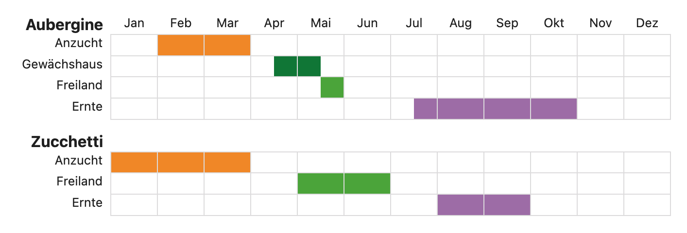

# Plant Calendar Obsidian Plugin
This Obsidian plugin lets you create simple calendar views which show just the months of the year. It's intended to be used for eg plant calendars.


## Usage
Create a code block with **plantcalendar**, eg:
````
```plantcalendar
Aubergine
Anzucht:2,3
Gewächshaus: .4,5.
Freiland: .5
Ernte: .7-10
Zucchetti
Anzucht: 1-3
Freiland: 5-6
Ernte: 8-9
```
````

Each plant is followed by  as many lines as wished, defining each a row in the calendar. The month can be defined as follows:
- 2,3: means February and March
- 2-4: means February, March adn April
- .6:  a dot removes half of the month, in this case only the 2nd part of June is marked

Colors are pre-defined for Anzucht, Gewächshaus, Freiland, Ernte. They can be adapted by css, the table having the class "plantcalendar". Every line gets a css class named the same as the parameter of the line, eg:
````
table.plantcalendar {
  tr.anzucht td:not(:empty):not(:first-child) {
    background-color: #F39200;
    color: #F39200;
  }
}
````

## Command
There is a command in the palette to add a calendar in edit mode. Search for "plantcalendar"

## Installation
1. git clone in your .obsidian/plugins
2. npm run dev to generate the main.js
3. activate the plugin in "Community plugins"
